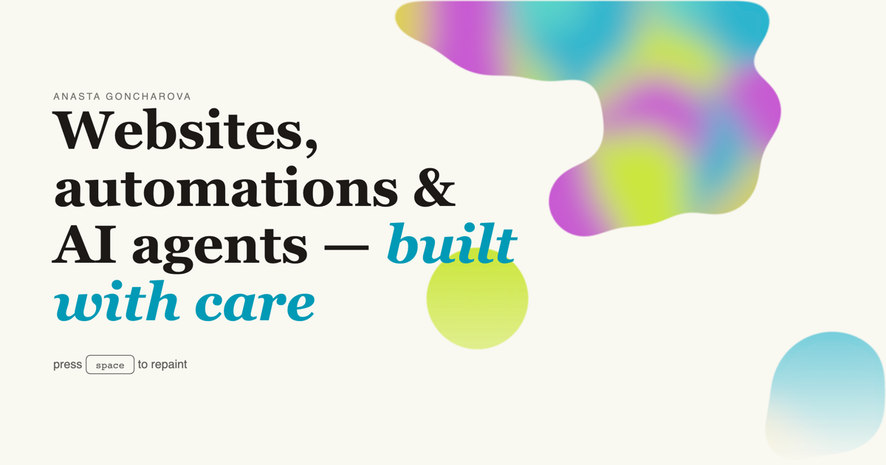

# anastacodes.github.io

My personal one-pager: **[anastacodes.github.io](https://anastacodes.github.io/)** — press space to repaint 🎨



## How it works

- **Palette engine** (chroma-js): generates harmonic palettes, keeps text WCAG-safe on every repaint, writes CSS custom properties, and serializes the palette into the URL hash — share a link, share your colors.
- **Lava lamp hero** — gooey metaballs (DOM blobs + SVG blur/alpha-threshold filter), slowly rising and merging, painted with the live palette. Alternative accents (flowing ribbons, a three.js blob) live behind a config flag.
- **GSAP ScrollTrigger** reveals, `prefers-reduced-motion` respected throughout.
- **Vite · TypeScript (strict) · Vitest** — the palette engine is unit-tested (generation, contrast, hash round-trip).

## Develop

```bash
npm ci
npm run dev     # localhost:5173
npm test        # vitest
npm run build   # dist/
```

Deployed to GitHub Pages via Actions on every push to `main`.
